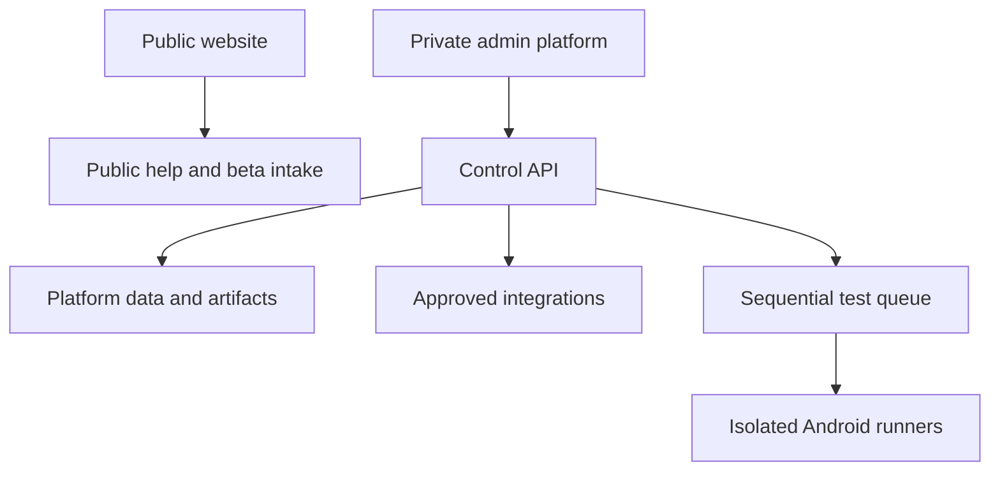
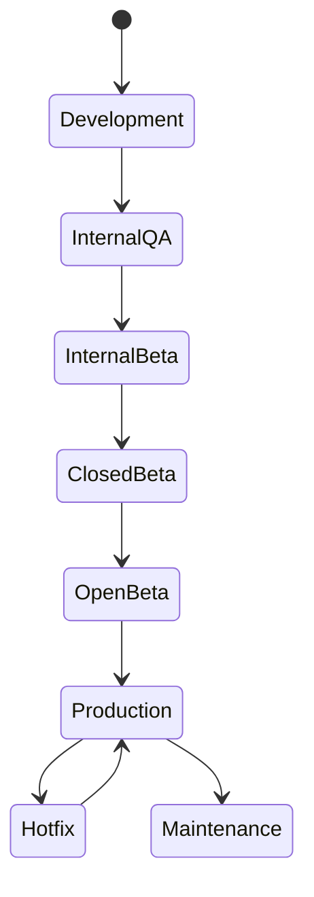

# Maxxed Platform v1 Specification

> **Security First.** Every feature, API, administrative page, automation, and
> integration must be designed with least privilege, auditability, and secure
> defaults. Convenience never overrides security.

## 1. Purpose

Maxxed Platform is the private operating system for managing a growing
portfolio of Maxxed Technical Systems products. It must provide a consistent,
measurable process for product development, quality assurance, beta testing,
support, monitoring, release approval, documentation, and security.

The public site at `techmaxxed.com` remains a low-risk static product catalog.
The private platform belongs on a separate hostname such as
`admin.techmaxxed.com` behind an identity-aware access layer.

## 2. Core Principles

### 2.1 Security First

- Authentication is required for every administrative function.
- Privileged accounts require multi-factor authentication.
- Authorization is enforced server-side on every protected request.
- Role-Based Access Control is used throughout the platform.
- New users and integrations receive no access beyond their stated purpose.
- Sensitive actions require explicit confirmation and, where appropriate,
  recent re-authentication.
- Administrative sessions expire automatically and can be revoked centrally.
- Secrets are stored in hosted secret management, never source code, browser
  bundles, logs, screenshots, or test evidence.
- Public APIs and authentication endpoints are rate-limited.
- Untrusted input is validated, bounded, normalized, and safely encoded.
- Database access uses parameterized queries and narrowly scoped data helpers.
- Outbound requests use destination allowlists and SSRF-resistant URL handling.
- State-changing browser requests use CSRF defenses and strict origin checks.
- HTML output is encoded and Content Security Policy limits script execution.
- Security headers include CSP, HSTS at the HTTPS edge, frame protections,
  MIME-sniffing protection, referrer policy, and restrictive permissions policy.
- Sensitive data is never returned to a client merely because the interface
  hides it.
- Destructive operations use confirmation, recoverability where appropriate,
  and an immutable audit trail.

### 2.2 Least Privilege

- Deny by default.
- Separate read, create, approve, deploy, administer, and export permissions.
- Separate service identities by integration and environment.
- Production access is distinct from development and testing access.
- Test runners never possess production signing keys.
- Support users see only diagnostics needed for the assigned case.

### 2.3 Auditability

- Every administrative mutation creates an audit event.
- Approval, deployment, tester enrollment, export, role change, and security
  change events are always audited.
- Audit events are append-only. Even an Owner cannot silently erase the audit
  trail; corrections are recorded as new events.
- Automated actions record the responsible service identity and originating
  human approval where one exists.

### 2.4 Explicit Promotion

- No release stage advances automatically merely because tests pass.
- Every stage transition requires an authorized approval.
- Production deployment requires QA approval and a separate Owner action.
- A readiness percentage never overrides a mandatory failed gate.

### 2.5 Truthful State

- Unavailable data is distinct from zero.
- Not run is distinct from pass.
- Blocked is distinct from fail.
- Estimates and measurements preserve their documented limitations.
- Development, beta, and production status are never inferred from a build file
  existing.

### 2.6 Portfolio Consistency

- Shared conventions apply across products.
- Product-specific exceptions are documented and approved.
- Reusable components reduce duplication without publishing private platform
  details on the public website.

## 3. System Boundaries

### Public Website

- Product catalog
- Public app status
- App-specific privacy policies
- Terms and accessibility
- Public help articles and FAQs
- Beta interest application
- Opt-in tester credits

The public website contains no admin code, private metrics, APK execution,
service credentials, internal documentation, or write access to production
records.

### Private Platform

- Identity-gated administration
- Role and permission enforcement
- Product, release, QA, beta, support, monitoring, and documentation workflows
- Private artifacts and evidence
- Audit and security monitoring
- Approved external integrations

### Runner Plane

- APK inspection and test execution
- Android SDK, emulators, and approved physical devices
- No production signing keys
- Restricted network access
- One leased job per device
- Evidence upload through narrowly scoped credentials

## 4. Authentication and Sessions

- Use Google Workspace or another approved identity provider through Cloudflare
  Access or an equivalent identity-aware proxy.
- Do not implement a custom username/password database for v1.
- Require MFA for Owner, Administrator, Developer, QA Lead, Beta Manager,
  Support, Documentation Editor, and Analytics Viewer roles.
- Beta Testers may use a separate low-privilege portal identity flow.
- Enforce maximum session lifetime and shorter inactivity expiration for
  privileged roles.
- Re-authenticate before role changes, security changes, domain changes,
  integration changes, billing access, sensitive exports, and production
  deployment.
- Allow immediate revocation of users, sessions, API tokens, runner identities,
  and integration credentials.
- Do not expose provider tokens to browser code.

## 5. Role-Based Access Control

Permissions are additive only through explicit role assignment. Custom
permissions may be introduced later, but v1 must begin with the defined roles.

### Owner

Full business and platform authority.

Can:

- Manage all users and role assignments
- Disable or remove user access
- Change security settings
- Manage billing
- Manage domains
- Manage integrations and service identities
- Approve and deploy production releases
- Manage retention and legal holds
- Perform destructive business-record operations subject to policy

Owner cannot silently delete or rewrite audit history.

### Administrator

Broad operating access except Owner-only actions.

Cannot:

- Manage billing
- Transfer ownership
- Weaken Owner or platform security controls
- Delete immutable audit history
- Change root domain ownership
- Deploy production unless separately granted through an Owner-approved policy

### Developer

Can:

- Upload builds
- Create release candidates
- View development logs and monitoring
- Edit product records
- Edit technical documentation
- Link commits, builds, and fixes
- Respond to assigned bugs

Cannot:

- Manage users or roles
- Change security policy
- Access billing
- View unrelated tester personal information
- Deploy directly to production

### QA Lead

Can:

- Create and version test plans
- Assign QA work
- Approve or reject release readiness
- Manage test suites and approved script definitions
- Manage tester assignments
- View automation evidence
- Set bug severity and priority
- Verify fixes
- Approve promotion through QA and beta stages

Cannot deploy production directly.

### QA Tester

Can:

- Run approved test suites
- Upload reports
- Submit and update assigned bugs
- Verify fixes
- Execute regression testing
- Attach screenshots, video, logs, and observations

Cannot:

- Edit production product content
- Change script definitions without review
- Approve a production release
- Access unrelated tester records

### Beta Manager

Can:

- Review beta applications
- Invite and remove testers
- Assign beta groups
- Manage test eligibility
- Create beta announcements and assignments
- Export tester lists when authorized
- Manage tester credit consent and published names
- Record inactivity and removal requests

Cannot access production signing, billing, or security settings.

### Beta Tester

Portal-only access.

Can:

- View assigned test builds and opt-in instructions
- View release notes and test assignments
- Submit feedback, bugs, suggestions, screenshots, and logs
- Vote on approved feature requests
- View personal testing history, badges, and credits
- Change public credit consent or request account removal

Cannot see other testers' private information or internal administrative data.

### Support

Can:

- Respond to assigned tickets
- Create and maintain help articles and FAQs
- View diagnostics approved for the case
- Link cases to known issues and releases
- Escalate bugs

Cannot change product releases, security settings, or tester group membership.

### Documentation Editor

Can:

- Edit documentation, tutorials, FAQs, and approved blog content
- Submit content for publication
- Publish public content when granted publication permission

Cannot access admin functions outside content management.

### Analytics Viewer

Read-only access to approved dashboards, including downloads, ratings, product
health, crash statistics, test summaries, and reports. Personal tester data and
raw sensitive logs remain excluded unless separately authorized.

## 6. Separation of Duties

| Action | Initiator | Required approval | Executor |
| --- | --- | --- | --- |
| Upload build | Developer | None | Developer |
| Approve QA completion | QA Lead | QA evidence complete | QA Lead |
| Promote to internal beta | Developer or QA Lead | QA Lead | Administrator or Owner |
| Promote to closed/open beta | Developer or QA Lead | QA Lead | Administrator or Owner |
| Deploy production | Developer prepares | QA Lead approves | Owner confirms and deploys |
| Emergency hotfix | Developer prepares | QA Lead or documented emergency override | Owner deploys |
| Add privileged user | Administrator proposes | Owner | Owner |
| Change security policy | Administrator proposes | Owner with re-authentication | Owner |
| Export tester list | Beta Manager | Policy check and logged purpose | Beta Manager |

No user may approve their own production release solely because they hold
multiple roles. The platform must preserve the required distinct approval
events.

## 7. Product Records

Each product contains:

- Product ID, name, slug, package ID, platform, and owner
- Repository and default branch references
- Current lifecycle and public status
- Current version and release track
- Supported devices, SDK range, and architecture
- Privacy policy, Terms, support, and store URLs
- Ads, analytics, accounts, network behavior, and permissions summary
- Known limitations
- Current blockers
- Release-readiness score and mandatory gate state
- Latest build, test, release, monitoring, support, and beta summaries

## 8. Beta Program

The beta subsystem is separate from general support and release management.

### Tester Record

Each tester may contain:

- Legal or contact name where required
- Public credit name
- Email or Google Account email
- Discord handle, optional
- Country
- Device category
- Android version
- Manufacturer
- Model
- Apps interested in
- Experience level
- Testing status
- Credits earned
- Badges
- Last active time
- Bugs submitted
- Suggestions submitted
- Assignments completed
- Group membership and Play opt-in state
- Contact consent
- Public credit consent
- Consent timestamps and policy version
- Removal or suppression state

Collect only fields needed for actual testing and program administration. Do
not collect street address, government identity, payment information, or other
unnecessary sensitive data.

### Testing Status

- Applied
- Email verification pending
- Review pending
- Approved
- Group enrollment pending
- Invited
- Active
- Inactive
- Paused
- Removed
- Removal requested
- Rejected

### Credits and Badges

Credits and badges are recognition, not compensation, employment, ownership,
or a promise of benefits.

Examples:

- Day One Beta Tester
- Device Coverage Contributor
- Regression Tester
- Accessibility Contributor
- High-Quality Bug Reporter
- Release Validation Contributor

Public display requires separate opt-in consent. Withdrawal removes future
display without erasing the private audit record of the consent change.

## 9. QA Program

### Test Assignment

Each assignment contains:

- Product
- Build and version
- Test plan version
- Assigned tester or group
- Required device profile
- Objectives
- Individual tasks
- Due date
- Required evidence
- Safety or privacy instructions
- Completion state
- QA review state
- Linked bugs and suggestions

Example Maxxed Compass assignment:

- Build 2.1.4
- Outdoor heading accuracy
- Battery test
- GPS drift
- Lock-screen behavior
- Notification actions
- Sky Scanner constellation guidance

Assignment completion updates the product dashboard only after required
evidence is submitted. A QA Lead controls whether the assignment satisfies a
release gate.

### Test Result States

- Not started
- In progress
- Pass
- Fail
- Blocked
- Skipped with approved reason
- Manual review
- Needs rerun

## 10. Bug Tracking

### Required Fields

- Issue ID
- Product and affected version
- Title and description
- Environment and device
- Android version
- Reproduction steps
- Expected behavior
- Actual behavior
- Severity
- Priority
- Status
- Assignee and reporter
- Screenshots, video, logs, or test evidence
- Linked test job, assignment, release, support case, and incident
- First affected version and fixed version
- Verification evidence
- Created, updated, and closed timestamps

### Severity

- **Critical:** Security compromise, destructive data loss, widespread startup
  failure, release-signing compromise, or essential product function unusable
  with no workaround.
- **High:** Major workflow unavailable, frequent crash, serious incorrect result,
  privacy failure, or broadly affected compatibility issue.
- **Medium:** Important defect with a workaround or limited scope.
- **Low:** Minor defect, polish issue, or low-impact inconsistency.

### Priority

- Immediate
- Next release
- Backlog

Severity describes impact. Priority describes scheduling. They must not be
silently coupled.

### Status

- New
- Triaged
- Assigned
- In progress
- Ready for QA
- QA
- Verified
- Ready for release
- Released
- Closed
- Reopened
- Duplicate
- Cannot reproduce
- Won't fix with reason

## 11. Automation Records

Every automation stores:

- Job ID
- Start and end time
- Product and APK version
- Artifact SHA-256 and signer identity
- Runner and device
- Script pack and individual script versions
- Immutable selected execution order
- Result and stop reason
- Screenshots
- Video
- Logcat
- Standard output and error
- Performance
- Memory
- Battery
- Crash and ANR data
- Manual observations
- Approval or override information

Selected app-specific scripts run strictly in succession. They are not
submitted as independent parallel jobs. One complete ordered job is leased to
one runner, which locks one device and advances step by step.

## 12. Release Pipeline

Every transition records:

- Actor
- Role
- Timestamp
- Source and destination stage
- Product and version
- Readiness score
- Mandatory gate state
- Approval evidence
- Override reason if policy allows an override

Production promotion requires an explicit QA Lead approval and a distinct Owner
confirmation. Hotfixes retain audit, testing, privacy, and signing requirements;
only the approved scope and timeline may be reduced.

## 13. Product Health Dashboard

Each app has one health page showing:

- Current version
- Play status and track
- Rollout percentage
- Crash-free users
- Crash rate
- ANR rate
- Slow start and rendering health
- Downloads and active devices where available
- Rating and review trend
- Open bugs by severity
- Active beta testers
- Latest automation result
- Last successful build
- Last release
- Current blockers
- Release-readiness score
- Data freshness and source status for every metric

Offline apps do not have application uptime. For them, monitor Play listing,
privacy URL, tester link, release health, crashes, and any actual network
dependency rather than inventing an uptime percentage.

## 14. Security Dashboard

Monitor:

- Failed logins and repeated authentication failures
- New administrative accounts
- Role and permission changes
- MFA enrollment and privileged-session state
- API authentication and authorization failures
- Suspicious traffic and rate-limit events
- Certificate and domain expiration
- Dependency vulnerabilities
- Secret-scanning findings
- Artifact signer mismatches
- Unexpected permissions or debuggable releases
- Audit-log integrity and ingestion delay
- Backup success, age, and restore-test status
- Runner health, stale leases, and unauthorized device connections
- Integration credential age and rotation status

Security alerts require severity, owner, status, evidence, and resolution. The
dashboard must not display secrets or full tokens.

## 15. Audit Log

Every administrative action records:

- Timestamp
- Actor ID
- Effective role and permission
- Session and authentication context
- Source IP when appropriate and lawful
- Action
- Target type and ID
- Before and after values with sensitive fields redacted
- Request or correlation ID
- Success, denial, or failure result
- Approval chain
- Automated service identity when applicable

Read-only page views do not all require full audit events, but views of highly
sensitive data, exports, raw crash logs, tester personal information, and
security settings should be recorded.

## 16. Internal Knowledge Base

Use a structured, versioned repository rather than scattered notes.

Sections:

- Architecture
- Security standards and threat models
- Release procedures
- QA checklists
- Store submission guides
- APK runner guides
- Incident response
- Backup and restoration
- Marketing templates
- Common fixes and error signatures
- Coding standards
- Branding assets
- App-specific help and limitations

Articles contain owner, audience, review date, classification, related product,
status, and revision history. Public articles require publication approval and
must not leak internal architecture or credentials.

## 17. Coding and Product Standards

- Consistent formatting and linting
- Unit tests where practical
- Integration and UI tests proportional to risk
- Clear separation of concerns
- Reusable components with documented ownership
- Minimal meaningful duplication
- Documented public interfaces
- WCAG 2.2 AA target for web interfaces
- Responsive layouts
- Defined performance budgets
- Actionable error handling and logs
- Input validation and safe output encoding
- Dependency and license review
- Secret scanning
- Threat modeling for sensitive features
- Secure defaults and explicit unsafe overrides
- No production release with known unexplained critical or high security issues

## 18. Product Readiness Score

The score makes missing release work visible. It is not an authorization
mechanism and cannot bypass mandatory gates.

### Weighted Categories

| Category | Weight |
| --- | ---: |
| Build and artifact integrity | 15 |
| Automated tests | 15 |
| Manual and physical QA | 20 |
| Security and privacy | 15 |
| Store compliance and assets | 10 |
| Documentation, help, and support | 10 |
| Versioning, release notes, and deployment preparation | 5 |
| Product health and known blockers | 10 |
| **Total** | **100** |

Each check is `pass`, `partial`, `fail`, `blocked`, `not_run`, or approved
`not_applicable`.

- Pass contributes full check weight.
- Partial contributes a policy-defined fraction, normally one half.
- Fail, blocked, and not run contribute zero.
- Not applicable removes a check only when the product policy explicitly marks
  it inapplicable and records who approved that decision.

### Mandatory Gates

Any failed mandatory gate sets the release state to **Blocked**, regardless of
percentage. Mandatory production gates include:

- Release artifact builds successfully
- Expected package and version identity
- Expected signing identity
- Non-debuggable production manifest
- Required automated tests pass
- Required physical and manual acceptance passes
- No unresolved Critical blocker
- No unresolved High security or privacy blocker
- Privacy policy and Data safety match the signed build
- Terms and support destination are available where required
- Required store assets and declarations are complete
- Release notes and rollback plan are present
- QA Lead approval exists

### Stage Guidance

| Stage | Suggested minimum | Additional rule |
| --- | ---: | --- |
| Development | None | Truthful status only |
| Internal QA | 50 | Build/install gate must pass |
| Internal beta | 70 | Core workflow and privacy review complete |
| Closed beta | 80 | Required device coverage and tester support active |
| Open beta | 90 | Store materials and public policies complete |
| Production | 95 | Every mandatory gate passes and approvals exist |

The dashboard displays both the percentage and the blocking gates. A product at
98% with an unexpected signing certificate remains blocked.

## 19. Backup, Recovery, and Retention

- Define retention separately for artifacts, test evidence, logs, audit events,
  support cases, beta records, and analytics.
- Encrypt backups and restrict restoration permission.
- Test restoration on a schedule.
- Display backup age and latest restore-test result on the security dashboard.
- Use soft deletion where recovery is valuable, but honor valid privacy deletion
  requests without destroying required security audit evidence.
- Document disaster recovery targets for the control plane.

## 20. v1 Delivery Order

1. Local Windows sequential APK runner
2. Identity-gated read-only product and health dashboard
3. Product records, bugs, QA plans, evidence, and readiness scoring
4. Beta application review and tester portal
5. Help center and internal knowledge base
6. Release pipeline and explicit approval workflow
7. Hosted artifact queue and remote runner integration
8. Google Play reporting and tester-group integrations
9. Security dashboard, alerts, backups, and mature audit reporting

## 21. v1 Definition of Done

- Public and private deployments are separated.
- Every admin route requires authenticated identity.
- Every protected action is authorized server-side.
- Defined roles and separation of duties are enforced.
- Privileged users use MFA-capable authentication.
- Administrative mutations create redacted audit events.
- Products, builds, releases, bugs, QA plans, assignments, and evidence are
  traceable.
- APK scripts run in immutable selected order with one active job per device.
- Beta tester contact and public credit consent remain separate.
- Health dashboards distinguish unavailable, delayed, zero, and healthy data.
- Readiness scores are reproducible and cannot override mandatory gates.
- Production promotion requires QA Lead approval and separate Owner action.
- Backups, restore tests, secret scanning, and dependency findings are visible.
- Public help content and private operational runbooks are maintained separately.
- No production secret or signing key is exposed to browsers or test runners.
