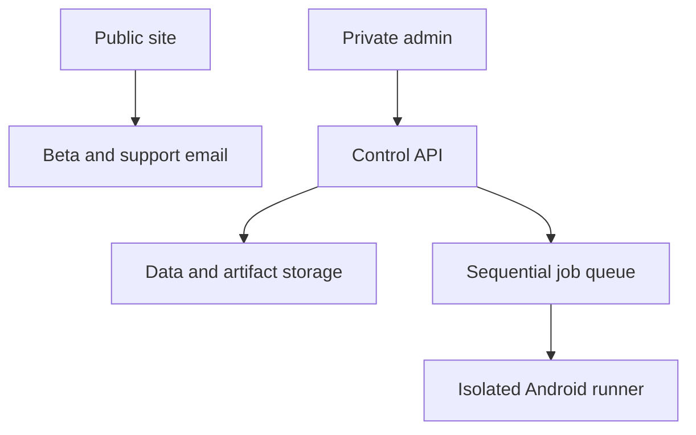
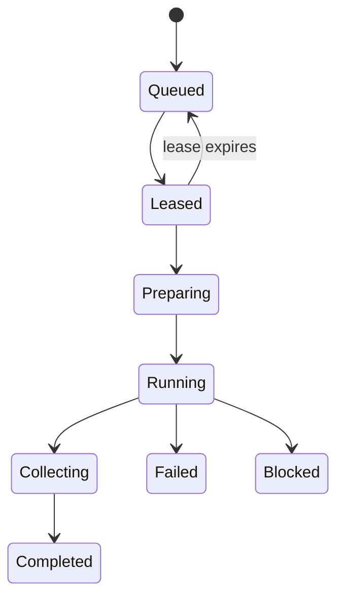

# Maxxed Private Operations Platform

> **Security First.** Every feature, API, administrative page, automation, and
> integration must be designed with least privilege, auditability, and secure
> defaults. Convenience never overrides security.

The canonical product, role, workflow, audit, and readiness requirements are
defined in `MAXXED_PLATFORM_V1_SPECIFICATION.md`. This document expands the
private operations and APK execution architecture.

## Objective

Build `admin.techmaxxed.com` as a private operating console for Maxxed Technical
Systems. It is not part of the public website and must not be deployed in the
same public static bundle.

The platform should centralize:

- App health, Android vitals, crashes, ANRs, and error issues
- Website and backend availability monitoring
- Release versions, Google Play tracks, rollouts, signing identity, and updates
- Beta applications, tester approvals, group membership, opt-in links, and credits
- Help content, support cases, known issues, and internal runbooks
- APK intake, verification, app detection, test selection, sequential execution, and evidence
- Audit logs for every administrative or release-impacting action

## Boundary

`techmaxxed.com` remains a static public site. It must not contain admin code,
credentials, write APIs, private metrics, APK uploads, test results, or internal
runbooks.

`admin.techmaxxed.com` is a separate application protected by an identity-aware
proxy such as Cloudflare Access. It should accept only explicitly allowed
Maxxed accounts and should use the identity headers supplied by the access
layer. Do not create a custom password database.



## Dashboard Modules

### 1. Portfolio Overview

Show one row per active product:

- Product name and package ID
- Current lifecycle: development, internal test, closed test, production
- Latest version name and version code
- Track and rollout percentage
- Last successful test and release date
- Current release-readiness status
- Crash rate, ANR rate, slow start rate, and open error issues
- Website, API, or service availability when the app has online dependencies
- Beta tester count and pending applications
- Open support cases and known issues
- Privacy policy and Data safety review status

Offline apps do not have meaningful application “uptime.” For those products,
the dashboard should report Play listing availability, test-link availability,
release health, crash-free behavior, and the status of any external dependency.

### 2. Health and Incidents

Integrate the Google Play Developer Reporting API for:

- Crash rate
- ANR rate
- Error counts
- Error issues and error reports
- Slow start and slow rendering
- Excessive wakeups and stuck background wakelocks where available
- Low-memory-kill rate where available

Each metric needs:

- Current value and prior-period comparison
- Version and device breakdown
- Threshold state: healthy, warning, critical, insufficient data
- Last successful synchronization time
- Source status so unavailable data is not displayed as zero

Incident records should include severity, affected products, detected time,
owner, current status, timeline, linked release, evidence, mitigation, and final
resolution. Never silently close an incident because a metric temporarily
stops reporting.

### 3. Availability Monitoring

Use synthetic monitoring for resources that can actually be reached over a
network:

- `techmaxxed.com` and important public pages
- Privacy-policy URLs used by Play listings
- Support and beta mail-domain health
- Public APIs and application backends
- Google Play listing and tester opt-in URLs
- Web dashboards and customer portals after they launch

Checks should validate more than HTTP 200. Where possible, confirm an expected
page title, response body marker, certificate validity, response time, and
redirect destination.

### 4. Releases and Updates

Track:

- Version name, version code, package ID, artifact SHA-256, and file size
- APK/AAB signing certificate SHA-256
- Expected signer match
- Debuggable state and manifest permission diff
- Target SDK, minimum SDK, supported architectures, and orientation
- Release notes and change summary
- Google Play track, status, rollout percentage, and countries
- Privacy policy, Data safety, content rating, ads declaration, and support URL
- Build/test evidence associated with the release
- Approval history and production promotion decision

The dashboard may prepare a release, but promotion to production should require
a second explicit confirmation and a complete release gate. No automatic
production rollout should occur from an APK test pass alone.

### 5. Beta Operations

Provide queues for:

- New applications
- Email verification pending
- Manual review pending
- Approved but not enrolled
- Group membership active
- Opt-in link sent
- Active tester
- Inactive or removal requested
- Public credit approved, declined, or withdrawn

Tester access and public credit are separate permissions. Removing public
credit must not automatically remove test access, and leaving a test must not
automatically erase an approved historical credit unless requested.

### 6. Help and Support

Provide two help layers:

Public help:

- App-specific setup guides
- Supported-device notes
- Permission explanations
- Known limitations
- Troubleshooting steps
- Privacy and deletion links
- Beta installation and feedback instructions

Private help:

- Release runbooks
- Incident response procedures
- APK runner setup and recovery
- Google Play track procedures
- Signing verification instructions without exposing private keys
- App-specific physical test plans
- Known failure signatures and approved fixes
- Escalation ownership

Support cases should be linked to app, version, device, Android version, test
job, incident, and release when relevant.

## APK Test Center

### User Workflow

1. Upload or select an APK.
2. Verify the displayed SHA-256 before continuing.
3. The system extracts package ID, version name, version code, signer, SDK
   levels, architectures, permissions, debuggable state, and launch activity.
4. The package ID maps the APK to a known Maxxed product.
5. The dashboard displays only compatible test scripts for that product.
6. The operator selects scripts and arranges their execution order.
7. The platform displays prerequisites, estimated duration, destructive steps,
   physical hardware requirements, and whether manual observation is required.
8. The operator submits one test job.
9. The job waits for the appropriate runner and device profile.
10. The runner installs the APK and executes every selected script in order.
11. The runner stops on a required-step failure unless the script explicitly
    allows continuation.
12. Logs, screenshots, video, device state, and structured results are uploaded.
13. The dashboard produces a pass, fail, blocked, or manual-review result.

### Sequential Execution Is Mandatory

Do not launch selected scripts as independent queue messages. One queue message
represents the complete ordered test job.

The job payload contains an immutable ordered array of script IDs. The runner
executes index `0`, records the result, then index `1`, and continues until the
array is complete or the stop policy triggers.



Set queue consumer concurrency to `1` for the first runner pool. Also enforce a
device-level lease in the database so a configuration mistake cannot run two
jobs against the same device. The queue setting is operational protection; the
database lease is the correctness guarantee.

### Runner Placement

Android execution cannot happen inside a Cloudflare Worker. Use one or more
isolated runner agents on machines with:

- Android SDK platform tools
- `adb`, `apkanalyzer` or `aapt2`, and `apksigner`
- Approved Android emulators and snapshots
- Optional connected physical Android devices
- Appium, UI Automator, Espresso instrumentation, shell scripts, or Robo scripts
  as required by each test
- A dedicated non-administrator operating-system account

Cloudflare Queues pull consumers can let an external runner lease jobs over
HTTPS. Another acceptable first implementation is a control API with a
single-runner lease table. In both cases, only the runner should have access to
the device bridge.

### Artifact Intake Gates

Before installation:

1. Enforce file type and maximum size.
2. Store the original artifact immutably and calculate SHA-256.
3. Parse the APK without executing it.
4. Reject malformed ZIP structures and unsupported split APK uploads.
5. Extract package, version, signer, SDK, ABI, permission, and debuggable data.
6. Compare package ID to the selected product.
7. Compare signer to the allowed signer set for that product.
8. Flag new permissions, removed permissions, target-SDK regressions, or ABI
   changes.
9. Run malware or policy scanning where available.
10. Require an explicit override reason for a debug-signed or unexpected-signer
    test artifact.

Production signing keys must never be present on test runner machines.

### Script Catalog

Each script definition should include:

```json
{
  "id": "launch-smoke",
  "app": "maxxed-compass",
  "version": 1,
  "label": "Install and launch smoke test",
  "runner": "adb",
  "timeoutSeconds": 120,
  "requires": ["android-emulator"],
  "destructive": false,
  "manualObservation": false,
  "continueOnFailure": false,
  "commandRef": "scripts/maxxed-compass/launch-smoke.ps1",
  "outputs": ["logcat", "screenshot", "result-json"]
}
```

The dashboard must never accept an arbitrary shell command from a browser.
Operators select version-controlled script IDs. The runner resolves a script ID
to an approved local command from a signed or pinned script catalog.

### Standard Test Order

1. Artifact verification
2. Device availability and clean-state check
3. APK install or upgrade path
4. Launch and crash smoke test
5. Permission-denial and permission-grant flows
6. App-specific functional scripts
7. Background, process-death, rotation, and reopen checks
8. Controlled robustness or Monkey/Robo test
9. Performance, memory, and log scan
10. Evidence collection
11. App data cleanup and uninstall unless retention is requested
12. Device health check and lease release

### App-Specific Suites

| Product | Automated or emulator-friendly | Physical or manual requirement |
| --- | --- | --- |
| Maxxed Remote | Install, launch, permissions, UI navigation, saved-device CRUD, invalid-host rejection | Real Samsung and LG pairing, control, trust, power, reconnect, and regional streaming IDs |
| Maxxed Compass | Install, permissions, process recovery scaffolding, history, settings, constellation rendering fixtures | Real sensor heading, true north, outdoor trip distance, lock screen, camera orientation, sky comparison, battery |
| Maxxed Measure | Launch, fixture-image math, history, rename, delete, export intent, invalid calibration | Known physical objects, camera distances, focus, lighting, perspective, and user correction |
| Maxxed Gold Estimator | Fixture images, quality rejection, mask, clustering, look-alike materials, ranges, CSV | Six-angle real sample capture, reference placement, wet/dry and lighting variation |
| Fishing Maxxed | Fixture measurement, species search, record CRUD, location redaction, regulation fail-closed, CSV | Real capture workflow, known fish-shaped objects, outdoor lighting, location behavior |
| Rival Rush | Scene navigation, buttons, scoring, reset, profile persistence, Word Rush alphabet, help and credits | Touch feel, two-player ergonomics, performance, device aspect ratios, final ad behavior |

Emulator success must never replace a required physical acceptance test.

### Evidence Per Step

Each step returns structured JSON:

- Start and end timestamp
- Runner and device profile
- Script definition version
- Exit code and normalized result
- Standard output and standard error
- Relevant logcat window
- Screenshots and video references
- App process state and crash detection
- Manual observation request and response
- Failure category and recommended next action

Use `pass`, `fail`, `blocked`, `skipped`, and `manual_review`; do not overload
`pass` to mean the script merely exited.

## Data Model

Core records:

- `apps`
- `app_versions`
- `release_tracks`
- `release_artifacts`
- `signer_identities`
- `test_script_definitions`
- `test_jobs`
- `test_job_steps`
- `runner_agents`
- `device_profiles`
- `device_leases`
- `test_evidence`
- `health_metric_snapshots`
- `error_issues`
- `incidents`
- `uptime_checks`
- `beta_applications`
- `tester_memberships`
- `tester_credit_consents`
- `support_cases`
- `help_articles`
- `audit_events`

Every mutable administrative record needs `created_at`, `updated_at`, actor,
and source. Sensitive tester information should not appear in general dashboard
exports.

## Roles

| Role | Access |
| --- | --- |
| Owner | All operations, security configuration, and credential rotation |
| Release Manager | Artifacts, tests, releases, rollouts, and incidents |
| QA Operator | Submit tests, view evidence, manage scripts through reviewed source changes |
| Tester Coordinator | Beta applications, memberships, communications, and credits |
| Support | Help content and support cases without release credentials |
| Read Only | Health, releases, incidents, and test results without mutation |

Use least privilege. Viewing crash stack traces, tester emails, or APK artifacts
should require specific permission rather than general dashboard access.

## Security Controls

- Identity-aware proxy and MFA-capable identity provider
- Explicit account allowlist and default-deny policy
- Separate production and development environments
- No custom passwords
- Short-lived signed artifact URLs
- R2 or equivalent private artifact storage
- D1 or a managed relational database for control-plane state
- Central secret storage with no credentials in source or browser code
- Service accounts separated by Google API purpose
- Append-only audit events for sensitive actions
- CSRF protection, origin checks, strict content security policy, and secure cookies
- Upload size limits, content validation, malware scanning, and retention rules
- Isolated runners with restricted network egress
- No production signing keys on runners
- Device leases, job leases, heartbeats, timeouts, and forced cleanup
- Redaction of tokens, emails, IP addresses, and sensitive app data from logs
- Backup and restore testing for control-plane data

## Delivery Phases

### Phase 1: Local Sequential Runner

- Windows-friendly local dashboard or CLI
- Select APK from disk
- Detect package and verify metadata
- Select approved app-specific scripts
- Reorder scripts
- Execute one job at a time against one emulator or device
- Produce a local HTML/JSON report with logs and screenshots

This creates immediate value without exposing an upload service.

### Phase 2: Private Read-Only Dashboard

- Cloudflare Access protection
- App and release inventory
- Play Developer Reporting API synchronization
- Website/API synthetic monitoring
- Incidents, known issues, and help runbooks
- Read-only test-result ingestion from the local runner

### Phase 3: Hosted Control Plane

- Private APK storage
- Job queue and pull-based runners
- Device leases and runner heartbeats
- Remote evidence upload
- Role-based job submission and approval

### Phase 4: Beta and Release Automation

- Verified beta application queue
- Google Group enrollment after approval
- Test opt-in communications
- Release track and rollout monitoring
- Controlled Play API actions with explicit confirmation

### Phase 5: Mature Operations

- Multiple runner pools with one job per device
- Regression comparison between versions
- Crash-to-test correlation
- Automated incident creation at approved thresholds
- Release-readiness scorecards and scheduled reports

## Definition of Done for the First Runner

- Accepts a valid APK without executing it during inspection
- Rejects package mismatch and records SHA-256
- Lists only scripts approved for the detected app
- Preserves the operator-selected order
- Runs no more than one job and one step at a time
- Stops correctly on required failure
- Times out and cleans up a hung script
- Captures logcat, screenshots, step output, and final result JSON
- Survives runner restart without falsely marking an incomplete job passed
- Locks and releases the selected device reliably
- Contains no signing keys or production secrets
- Runs from Windows PowerShell without requiring WSL
